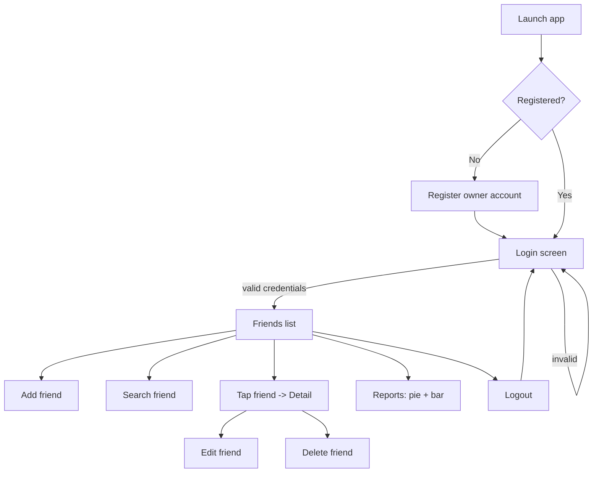

# User flow

```mermaid
flowchart TD
    A[Launch app] --> B{Registered?}
    B -- No --> R[Register owner account]
    R --> C[Login screen]
    B -- Yes --> C
    C -->|valid credentials| L[Friends list]
    C -->|invalid| C
    L --> ADD[Add friend]
    L --> SEARCH[Search friend]
    L --> TAP[Tap friend -> Detail]
    TAP --> EDIT[Edit friend]
    TAP --> DEL[Delete friend]
    L --> REP[Reports: pie + bar]
    L --> OUT[Logout]
    OUT --> C
```

The list is the home screen after login. Add, search, detail (edit/delete),
reports, and logout are all reachable from it.
